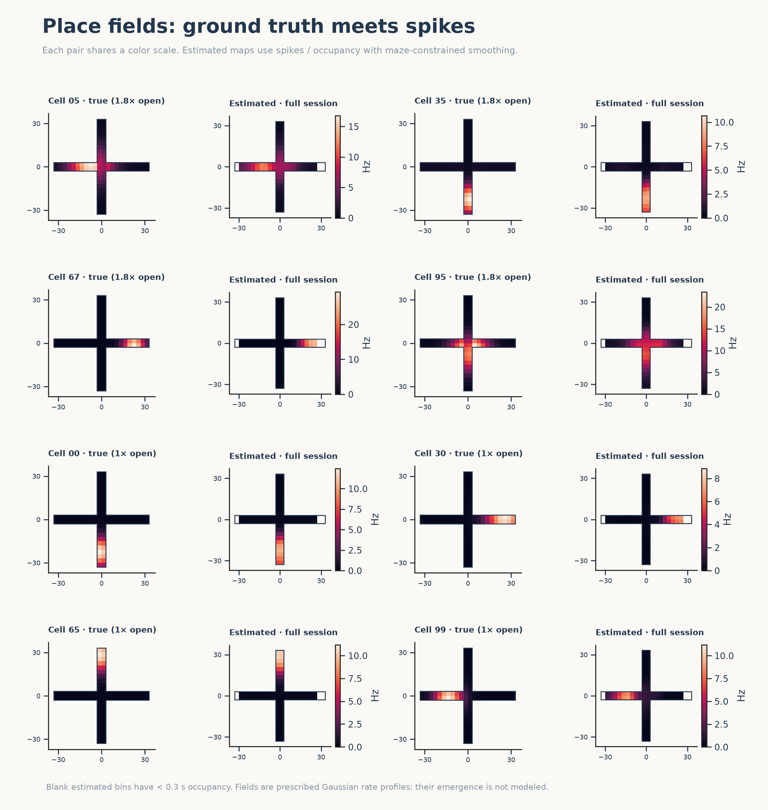
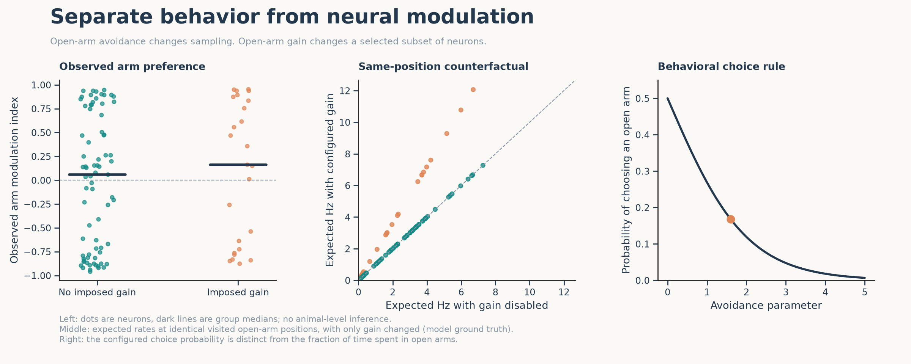
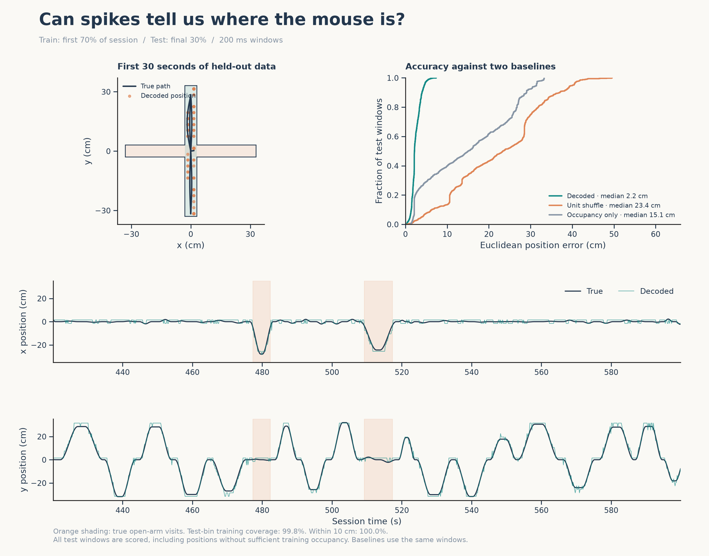

# Interpreting the plots

[Back to README](README.md) · [Methods and equations](METHODS.md) · [Try an experiment](EXERCISES.md)

This guide assumes no prior experience with place cells. All figures come from a
synthetic mouse: we know how every spike was generated. That makes the example useful
for learning analysis, while limiting what it can tell us about real brains.

## A short vocabulary

| Term | Meaning in this project |
| --- | --- |
| Spike | An event representing a neuron's action potential. |
| Firing rate | Average number of spikes per second, measured in hertz (Hz). |
| Place field | A region where a neuron has elevated firing probability. A cell need not fire every time the mouse visits. |
| Population code | Information carried jointly by many neurons with different firing patterns. |
| CA1 | A hippocampal subregion commonly studied in spatial coding. Our neurons are simplified CA1-like units. |
| Occupancy | The amount of time the mouse spends in a location. |
| Encoding model | A rule that predicts neural activity from variables such as position. |
| Decoder | A rule that estimates a variable, here position, from neural activity. |
| Ground truth | The known values used to generate the synthetic data. |
| Held-out data | Samples reserved for evaluation, excluded when fitting the decoder. |

In this maze the horizontal arms are open, the vertical arms are closed, and the small
central square connects them. “Closed” refers to walls, not an inaccessible arm.
The display is a top-down view; elevation is not simulated.

## 1. Exploration, occupancy, and spikes


**Trajectory, upper left.** Lines trace the mouse's position. The excursions cluster
along the closed arms because the movement generator favors them. The recurring
out-and-back curves also reveal the simple movement model: it returns to the center
between excursions. Real mouse behavior would be more varied.

**Occupancy, upper middle.** Color measures seconds spent in each spatial bin. This is
a behavioral map, not a neural activity map. Strong central occupancy partly reflects
the repeated center crossings and pauses in this model. Very dark arm tips have little
sampling and will be difficult to characterize from spikes.

**Time by zone, upper right.** Percentages use the whole session, including the center.
In the included example, open-arm time is about 14% of the full session, but about 19%
of time spent in either arm type. Both are valid descriptions with different denominators.
Entry fraction is different again: 15 of 66 entries went to open arms. State the
denominator whenever reporting an avoidance measure.

**Spike raster, lower left.** Each row is one neuron and each dot is a spike. A dense
patch along a row indicates more activity during that interval. Neuron ID is an
arbitrary label; vertical order does not represent electrode depth or field location.
Orange marks cells assigned an open-arm gain, even while the mouse is in a closed arm.
Apparent activity bands can arise because many fields overlap near the current position;
the model contains no direct coupling between neurons.

**Open/closed rate scatter, lower right.** Each dot is one neuron. A point above the
diagonal fires more per second in open arms; below the diagonal it fires more in closed
arms. Counts are divided by time in that arm type, so simply spending longer in closed
arms does not mechanically raise the mean rate. However, place-field location and
which parts of an arm are visited still influence the comparison.

**Takeaway:** inspect behavior and sampling before interpreting neural selectivity.

## 2. Ground-truth and estimated place fields



Each pair shows one neuron's prescribed rate map and a map estimated from its spikes.
Brighter color means higher firing rate, in Hz. A “1.8× open” label means the neuron's
rate is multiplied by 1.8 on open arms; it does not necessarily mean its field lies there.

The estimate starts from the number of spikes in each location and the time spent there.
For example, 20 spikes during 10 seconds of occupancy is 2 Hz; 20 spikes during
2 seconds is 10 Hz. A raw spike-count map would miss this distinction.

The implementation smooths counts and occupancy separately, divides them, and applies
a small stabilizing prior. Smoothing reduces noise but also blurs or lowers peaks.
It uses distances along the maze grid so it does not smooth directly across off-maze
corners. See [Methods](METHODS.md) for the precise rule.

Blank regions **inside** an estimated maze have too little occupancy to display an
estimate. They do not establish that the cell was silent there. Dark colored bins, in
contrast, represent a low estimated rate. Ground truth remains visible at unvisited
locations because we supplied the rate function ourselves.

Each true/estimated pair shares a color scale; different neurons may have different
scales. Compare locations and shapes across cells, but read the color bars before
comparing absolute rates. Only eight example cells are displayed.

**Takeaway:** a recovered field is an estimate shaped by sampling, stochastic spikes,
bin size, and smoothing. These maps show prescribed fields; they do not demonstrate
place-field formation or learning.

## 3. Spatial preference versus imposed arm gain



**Left: observed arm preference.** The modulation index is

```text
(open-arm rate − closed-arm rate) / (open-arm rate + closed-arm rate)
```

Positive values favor open arms; negative values favor closed arms; zero means equal
mean rates. Dots are neurons, and horizontal bars are group medians. An index near +1
can occur in a neuron without imposed gain if its place field lies in an open arm.
Thus even occupancy-normalized rates do not isolate a psychological variable.

**Middle: a model counterfactual.** Both coordinates use the same visited open-arm
positions. The horizontal axis predicts firing with arm gain disabled, and the vertical
axis predicts firing with the configured gain. Unmodulated neurons fall on the diagonal;
default modulated neurons lie above it. These are expected rates from the known model,
not noisy measured averages or an effect estimated from experimental data.

The comparison cleanly isolates gain because we can change the generator while keeping
position fixed. With real recordings, position and arm type are entangled: a fixed
point in this maze is always in the same arm type. Separating context from location
would require an experimental design or additional assumptions, not merely another
regression term.

**Right: behavioral choice rule.** Increasing the avoidance parameter reduces the
probability of selecting an open arm on the next excursion. This curve is the rule we
programmed, not a fitted result. The default also shortens open-arm excursions and
pauses, so choice probability and occupancy fraction need not match.

**Takeaway:** behavior, spatial firing, and a context-dependent gain are distinct
ingredients. In this simulation, none supplies evidence that the cells cause avoidance
or encode anxiety.

## 4. Decoding position from spikes



The decoder first learns which firing rates tend to occur at each sampled location.
For a new 200 ms window of population spikes, it asks which candidate position best
explains those counts under the independent Poisson model, combined with a prior
based on training occupancy. The highest-posterior bin is the prediction.

Training uses the first 70% of the session. Evaluation uses the final 30%. The
full-session place-field images above are for visualization and are **not** the maps
used to fit the decoder.

**Upper left.** A short true trajectory is overlaid with decoded positions. Predictions
are grid-bin centers, so they appear quantized. This panel is only a 30-second excerpt;
the accuracy curves use every test window.

**Upper right.** Each cumulative curve answers: “What fraction of predictions have an
error no larger than this many centimeters?” A curve rising quickly on the left is
better. Its halfway point is the median error; it does not show the worst error.

The comparison methods are deliberately simple:

- **Occupancy only:** always choose the most occupied training bin. This checks how
  much can be achieved using the mouse's spatial preference alone.
- **Unit shuffle:** permute neuron identities in the test counts, breaking their
  correspondence with the learned fields. This is one fixed permutation, not a
  significance test or an estimate of a universal “chance level.”

**Lower panels.** Dark traces are the mouse's actual x/y positions; teal traces are
decoded positions. Orange shading marks true open-arm visits. Close traces indicate
small coordinate errors. An excursion along one axis naturally leaves the other
coordinate close to zero.

The default median error of about 2.2 cm is small partly because this is a favorable
problem: stable fields, many neurons, clean spikes, and no sorting errors. Even a
perfectly chosen bin retains discretization error because its center need not equal
the mouse's exact location. Good decoding does not prove that a real mouse's brain
uses this decoder.

The decoder can select only adequately sampled training bins. All test windows are
still scored, including those outside that support. The coverage percentage describes
support at test-window target positions, not the fraction of total maze area explored.
Check `summary.json` for errors by zone: a pooled score can be dominated by the more
frequently visited closed arms. It describes one simulated session, not performance
across independent animals.

## 5. Reading the animation

The mouse marker and trail show the current position and preceding five seconds.
The raster scrolls through those same five seconds of spikes. Playback is accelerated
5×, and only a 60-second excerpt is shown. If an open-arm visit occurs, the excerpt is
chosen to include one; its apparent open/closed balance is therefore not an unbiased
summary of the full session.

## Questions to keep asking

For an unsupervised view of these same neurons, see the [PCA lesson](PCA_LESSON.md)
and its separate instructor reference. PCA describes population variance rather than
predicting location in held-out time windows, so its figures answer a different question
from the decoder above.

1. Is a pattern a property of the generator, an estimate from samples, or a held-out result?
2. Could occupancy or spatial preference explain an apparent neural difference?
3. What is the comparison method, and does it answer the question I care about?
4. Which parts of the maze or behavior were sampled poorly?
5. What would I have to change before making an inference about a real animal?

Try these ideas in [Classroom exercises](EXERCISES.md). Research references and the
full numerical assumptions are in [Methods](METHODS.md#scientific-context).
