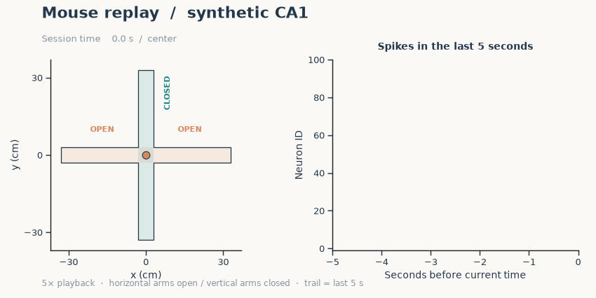
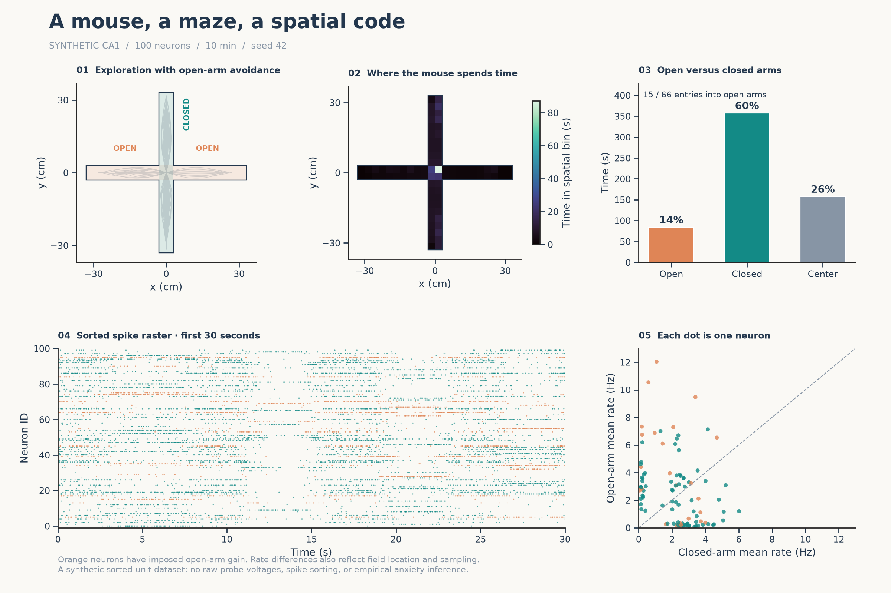

# Placefield Lab

**Watch a synthetic mouse explore an elevated plus maze, then reconstruct its location from simulated hippocampal spikes.**



An approachable Python teaching project for spatial coding, synthetic data generation,
and neural decoding. Built during a demonstration of AI-assisted neuroscience workflows
for students at the University of British Columbia.

The default experiment contains one synthetic mouse, 100 CA1-like place cells, and
10 minutes of exploration. The mouse favors closed arms. Selected neurons also have
an independently adjustable open-arm firing gain. The output represents **synthetic
sorted spike trains**, as one might analyze after Neuropixels recording and sorting;
raw probe signals are not simulated.

**New to place cells?** Start with [Interpreting the plots](INTERPRETING_THE_PLOTS.md).
For equations and assumptions, see [Methods](METHODS.md). For hands-on activities,
try the [Classroom exercises](EXERCISES.md).

## Quick start

Use **Python 3.12** for the demonstrated environment. A fresh virtual environment is
recommended. No GPU, animal data, or API key is needed.

Download and extract the repository ZIP, or clone it:

```bash
git clone https://github.com/ubcbraincircuits/placefield_lab.git
cd placefield_lab
```

### Windows · PowerShell

These commands call the environment's interpreter directly, so activation is unnecessary:

```powershell
py -3.12 -m venv .venv
.\.venv\Scripts\python.exe -m pip install -r requirements.txt
.\.venv\Scripts\python.exe run.py --animate
```

### macOS or Linux

Use `python3.12` in place of `python3` below if you have several Python versions installed:

```bash
python3 -m venv .venv
.venv/bin/python -m pip install -r requirements.txt
.venv/bin/python run.py --animate
```

Figures and data appear in `results/`. Open the PNGs or GIF in your usual image viewer.
The script works without a graphical desktop. Omit `--animate` to skip GIF rendering.
Each run replaces matching output files, so use `--out` to keep separate experiments.

`requirements.txt` contains the direct dependencies with version ranges;
`requirements-lock.txt` records the exact packages used for the included example
(Python 3.12.10, Windows). Use the lock file instead of `requirements.txt` when trying
to reproduce that environment. Exact numbers may differ with software versions.

## What you will see

| Figure | Question it answers |
| --- | --- |
| [Exploration and spikes](docs/assets/01_overview.png) | Where does the mouse go, and when do neurons fire? |
| [Place fields](docs/assets/02_place_fields.png) | How do spike-derived spatial firing maps compare with the prescribed fields? |
| [Arm effects](docs/assets/03_arm_effects.png) | How do spatial preference and an imposed open-arm gain differ? |
| [Position decoding](docs/assets/04_decoding.png) | Can held-out spike counts reveal the mouse's position? |
| [Mouse replay](docs/assets/05_mouse_replay.gif) | What do movement and neural activity look like together? |



The included **seed-42 example** produced:

| Measure | Result |
| --- | ---: |
| Open-arm / closed-arm time | 84.36 s / 357.74 s |
| Center time | 157.90 s |
| Total spikes | 159,500 |
| Held-out median decoding error | 2.17 cm |
| Occupancy-only baseline error | 15.08 cm |
| Shuffled-neuron baseline error | 23.40 cm |

These are illustrative simulation results, not expected performance in a real animal.
The decoder is tested on the final 30% of the session; its maps and prior are learned
only from the first 70%. See the saved [example summary](examples/seed42_summary.json).

## Change the experiment

In the examples below, `python` means your environment's interpreter:
`.\.venv\Scripts\python.exe` on Windows or `.venv/bin/python` on macOS/Linux.

```bash
# Equal arm-choice weights and identical reach/dwell distributions across arm types
python run.py --avoidance 0 --out experiments/no_avoidance

# Keep the default behavior but remove neural open-arm gain
python run.py --open-gain 1 --out experiments/no_gain

# A shorter simulation with fewer neurons
python run.py --duration 120 --cells 30 --out experiments/short_session

# Another synthetic mouse trajectory and cell population
python run.py --seed 7 --out experiments/seed7
```

Edit [config.json](config.json) for further controls, including the fraction of
modulated neurons, map smoothing, and decoding window. Each output directory stores
the effective configuration and software versions. Independent random streams govern
movement, cell parameters, and spike generation.

## Read the generated data

CSV exports are convenient for inspection. `session.npz` preserves the numeric arrays
for analysis without pickle objects:

```python
import numpy as np
import pandas as pd

session = np.load("results/session.npz", allow_pickle=False)
position_cm = session["position_cm"]        # time × 2: x, y
spike_counts = session["spike_counts"]      # time × neuron
spikes = pd.read_csv("results/spikes.csv")  # time_s, unit_id
decoded = pd.read_csv("results/decoding.csv")
print(position_cm.shape, spike_counts.shape)
```

Data units, array dimensions, and the file inventory are in [Methods](METHODS.md#files-and-data).
Full regenerated datasets are ignored by Git. A small curated gallery is committed in
`docs/assets/`, and a compact CSV teaching dataset is included in `teaching/pca/`.
Students can inspect the example before installing anything.

## PCA lesson and CSV handout

The [PCA lesson](PCA_LESSON.md) provides ready-to-use **1,200 × 100 firing-rate data**,
matching time/position/arm labels, and a separate instructor reference. Students can
work directly from [the numeric CSV](teaching/pca/student_data/neural_rates_hz.csv)
without installing or running this simulator. Keep metadata out of the PCA feature matrix.

To regenerate the exports and reference figures from `results/session.npz`:

```bash
python pca_reference.py
```

The reference includes standardized and centered-only PCA, explained variance,
2D/3D projections, and component weights. No additional dependencies are required.

## Check the model

```bash
python -m unittest discover -s . -p "test_*.py" -v
```

The checks cover maze boundaries, continuous movement, spike/occupancy conservation,
reproducible seeds, isolated modulation, training/test separation, decoder arithmetic,
and reduced open-arm time across multiple random seeds. A GitHub Actions workflow
is included to run the checks and a short rendering smoke test on Linux, macOS,
and Windows with Python 3.12. Its remote status is available after publication.

## Assumptions worth understanding

- Place fields are **prescribed**, not learned by a network. This is a model of spatial
  firing and readout, not an explanation of how place fields develop.
- Open-arm avoidance and neural arm gain are **separate imposed mechanisms**. The
  neurons do not drive the mouse's behavior in this model.
- Clean independent Poisson spikes make this an intentionally favorable decoding
  problem. Real data include many effects absent here.
- An open-arm firing preference alone does not establish anxiety coding. This project
  does not reproduce a particular CA1 subregion, experiment, or biological population.

## Background and project history

The implementation draws on the general ideas of high-density electrophysiology,
place-cell population decoding, and context-dependent hippocampal activity. The
[Methods references](METHODS.md#scientific-context) distinguish those ideas from
the parameters chosen for this demonstration.

The first prototype was developed with Codex during a live teaching demonstration.
The simulation, figures, and tests are available for inspection and modification.
Passing software tests establishes specific implementation properties, not biological
validity. Suggested extensions include speed/direction effects, theta modulation,
multiple animals, and more realistic recording noise.

## License

[MIT](LICENSE). See [Publishing to GitHub](PUBLISHING.md) for maintainer setup instructions.
