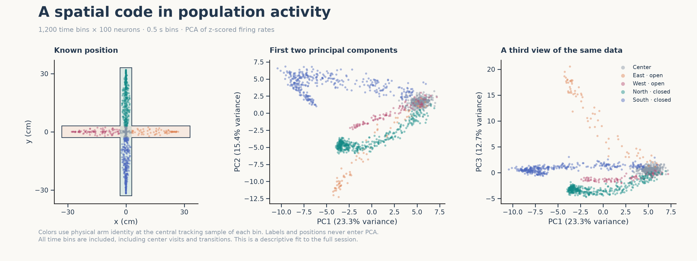
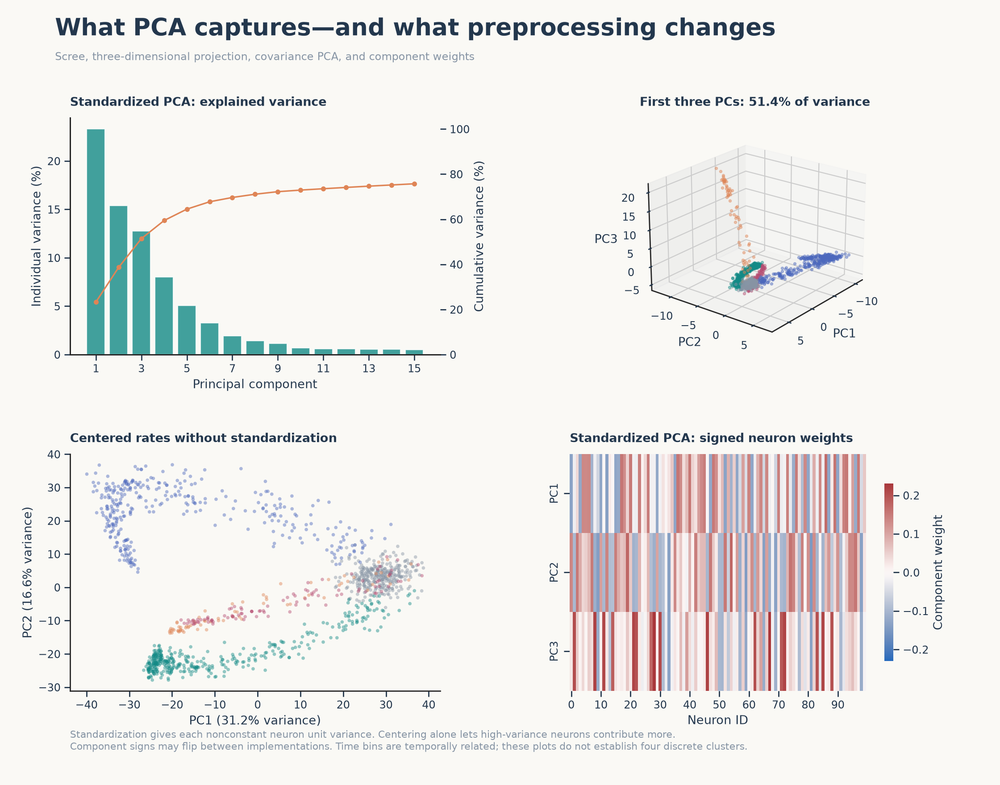

# Instructor PCA reference

[Assignment and preprocessing](../../../PCA_LESSON.md) · [Student data](../student_data/README.md)

These reference results use the included seed-42 dataset: all 1,200 half-second bins
and 100 neurons. PCA was fitted to the exported CSV itself. No metadata columns enter
the fit; colors are added afterward. The source and feature-matrix checksums are saved
with the data and summary.

## Spatial projections

The standardized projection shows arm-related branches connected near the center,
with overlap. The north/south closed-arm structure is particularly visible in PC1–PC2;
PC3 makes the east open-arm excursion more distinct. These patterns are descriptive
features of this particular simulation, not evidence for four statistically validated
clusters. Reading several projections helps avoid conclusions caused by overlap in
a single 2D view.

The first three standardized components explain approximately **23.30%, 15.37%, and
12.74%** of the variance. The first two retain **38.67%**; the first three retain
**51.41%**. It takes **24 components** to reach 80%, so the attractive low-dimensional
view still omits substantial variance.

## Variance and preprocessing

- **Upper left:** bars give individual standardized-PC variance on the left axis;
  the orange line gives cumulative variance on the right. Only the first 15 PCs are
  shown; the CSV contains all components.
- **Upper right:** the same standardized points in the first three components.
  Colors match the first figure.
- **Lower left:** centered rates without standardization. Its first three components
  explain approximately **31.21%, 16.60%, and 7.14%**. Axes and distances differ from
  standardized PCA because neuron variances have not been equalized.
- **Lower right:** signed eigenvector coefficients for the first three standardized
  components, in the original neuron order. These are component weights, not firing
  rates or neuron–score correlations. A global sign flip of any component is equivalent.

The included data contain 382 north-arm, 338 south-arm, 97 west-arm, 72 east-arm,
and 311 center bins, using the label at each bin's central tracking sample. Unequal
sampling is part of this example. All 123 transition bins are included.

## Numeric answers

For each prefix, `standardized` or `centered_only`:

- `*_scores.csv`: time bins × PCs, in the student data's original row order.
- `*_weights.csv`: neurons × PCs. The `neuron` column identifies the feature.
- `*_variance.csv`: component number, eigenvalue, explained-variance ratio, and cumulative ratio.

[summary.json](summary.json) provides compact numerical checks. To reconstruct centered
and scaled data from all components, multiply the scores by the transpose of the
weights matrix after removing its neuron-label column. To reconstruct Hz, reverse
the feature standardization and add the original feature means.

The automated checks compare SVD eigenvalues with a covariance eigendecomposition,
verify full reconstruction, check invariance to positive feature rescaling after
standardization, and confirm spike conservation through time binning. All results
are descriptive; no accuracy or significance claims are inferred from these plots.
